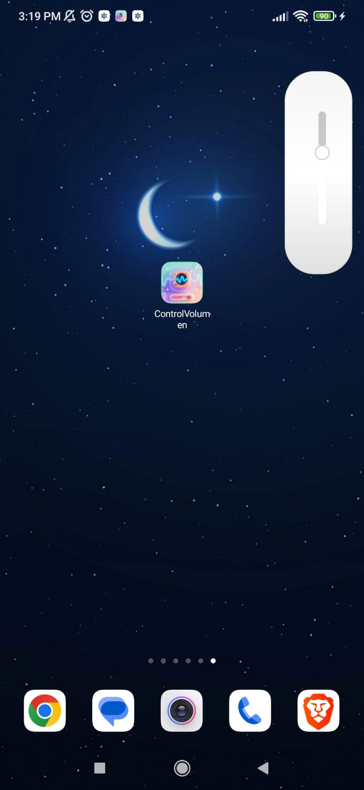
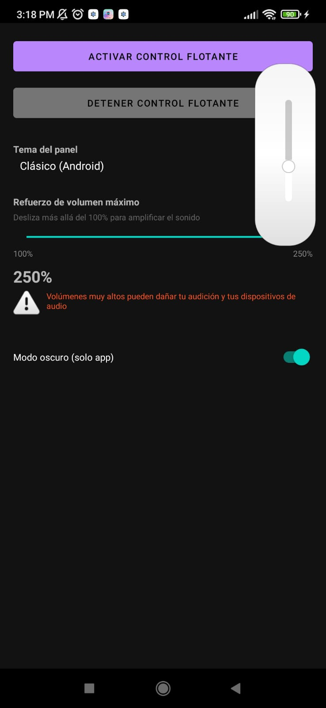

# 🎚️ ControlVolumen

Aplicación Android que superpone una **barra deslizante de volumen multimedia** sobre cualquier pantalla; desliza desde el borde para mostrarla u ocultarla sin salir de la app que estés usando.


---

## 📱 Capturas de Pantalla

<p align="center">
  
  
</p>

---

## 🎮 Características

- Barra flotante (overlay) que aparece sobre cualquier aplicación  
- Control exclusivo del volumen de multimedia del sistema  
- Se muestra / oculta con un simple gesto de deslizamiento  
- Compatible desde Android 5.0 (API 21)

---

## 🛠️ Stack Técnico

| Tecnología | Uso |
|------------|-----|
| Kotlin | Lenguaje principal |
| Android SDK | Framework nativo |
| Gradle Kotlin DSL | Automatización de builds |
| Material Design | UI / UX |
| Service + `SYSTEM_ALERT_WINDOW` | Overlay flotante |

---

## 📂 Estructura del Proyecto

ControlVolumen/  
├── app/src/main/java/com/example/controlvolumen/  
│   ├── MainActivity.kt  
│   └── VolumeOverlayService.kt  
├── app/src/main/res/  
│   ├── layout/  
│   │   ├── activity_main.xml  
│   │   └── floating_volume_control.xml  
│   └── values/strings.xml  
├── build.gradle.kts  
└── settings.gradle.kts  

---

### 🔐 Permisos

| Permiso               | ¿Por qué?                                  |
| --------------------- | ------------------------------------------ |
| `SYSTEM_ALERT_WINDOW` | Dibujar la barra flotante sobre otras apps |

### ▶️ Uso Rápido
Abre la app y pulsa “Iniciar Barra de Volumen”.
Concede el permiso de superposición.
Desliza desde el borde para mostrar/ocultar el control.
¡Listo! Ajusta el volumen sin cerrar tu juego o reproductor.

### 📌 Notas de Desarrollo
El servicio VolumeOverlayService vive en primer plano para evitar que el sistema lo mate.
El control se oculta 3 s después de soltar la barra (configurable).
Pensado como plantilla: puedes agregar temas, más flujos de audio o widgets extra.

### 📄 Licencia
MIT © 2024 – puedes usar, modificar y distribuir el proyecto libremente.

## 🚀 Instalación

### Opción 1 – APK rápida
1. Descarga el APK:  
   👉 [app-debug.apk](https://github.com/ArielNeR/BingoRoyale/raw/master/apk/app-debug.apk)
2. Activa “Orígenes desconocidos” en Ajustes → Seguridad.
3. Abre el APK y confía la instalación.

⚠️ Android advertirá sobre instalaciones externas a Play Protect; es normal en APKs de desarrollo.

### Opción 2 – Compilar desde código
```bash
# Clonar
git clone https://github.com/ArielNeR/ControlVolumen.git
cd ControlVolumen

# Importar en Android Studio
# Build → Run en dispositivo/emulador